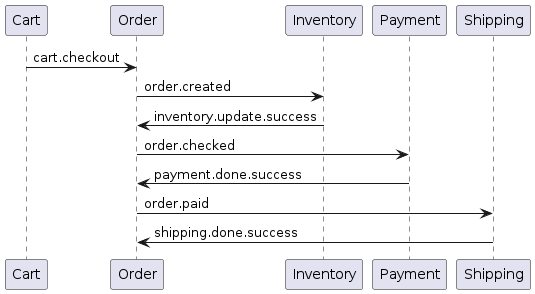

# Polyshop Microservices Project

This repository contains the complete source code for the Polyshop microservices project. The project is a simple e-commerce platform consisting of several microservices, each handling a specific functionality like catalog, cart, order, inventory, payment, and shipping. These microservices communicate with each other using RabbitMQ message queues.

## Repository Structure

- **catalog** - Contains the Catalog microservice code.
- **cart** - Contains the Cart microservice code.
- **order** - Contains the Order microservice code.
- **inventory** - Contains the Inventory microservice code.
- **payment** - Contains the Payment microservice code.
- **shipping** - Contains the Shipping microservice code.
- **docker-compose** - Contains Docker Compose configuration files for local development (`docker-compose.local.yaml`) and production (`docker-compose.prod.yaml`).
- **docs** - Contains the documentation for the project, including message flows and HTTP API documentation.
  - **message-flows** - Contains a UML diagram representing the message exchange between microservices during a checkout process.
  - **http-api** - Contains the HTTP API documentation for all microservices.

## Installation and Configuration

1. Clone this repository:

```bash
git clone https://github.com/yourusername/polyshop.git
```

2. Initialize and update the Git submodules (microservices):

```bash
cd polyshop
git submodule init
git submodule update
```

3. Install Docker and Docker Compose on your machine if you haven't already. You can follow the installation instructions on Docker's official website: https://docs.docker.com/get-docker/ and https://docs.docker.com/compose/install/.

4. Run the Docker Compose configuration file suitable for your environment:

- For local development:

```bash
docker-compose -f docker-compose/docker-compose.local.yaml up -d
```

- For production:

```bash
docker-compose -f docker-compose/docker-compose.prod.yaml up -d
```

This will start all the necessary containers for the microservices and their dependencies.

5. The microservices should now be up and running. You can access their HTTP API endpoints as described in the `docs/http-api` directory.

## HTTP APIs

HTTP API definitions can be found in docs/http-api folder.

## Checkout workflow

Messages are sent following saga orchestration architecture. Order service become the orchestrator.

### Checkout success:



### Checkout cancelled because of inventory failure:


### Checkout cancelled because of payment failure:


### Checkout cancelled because of shipping failure:


## Additional Information

- Each microservice has its own Dockerfile and a docker-compose.yaml file for containerization.
- All services are written in Java with Spring Boot, except for the frontend, which is written in TypeScript with RemixJS, React, and MUI.
- The Catalog, Cart, Order, and Inventory microservices have their own databases (MongoDB for Catalog and Inventory, Redis for Cart, and PostgreSQL for Order).
- The Payment and Shipping microservices are dummy services that simulate payment processing and shipping, respectively.
- The README files for each microservice with more explanation can be found in their respective directories in this repository.
- The Order microservice follow the **CQRS / Event Sourcing** architecture.
