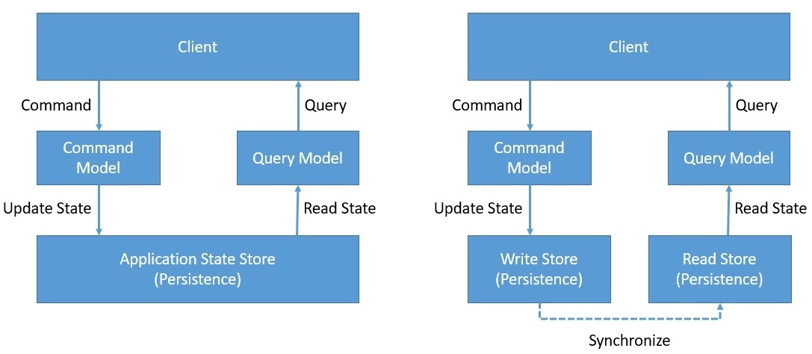
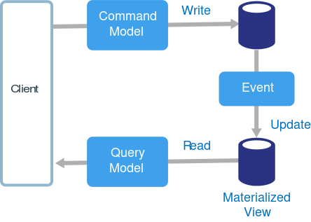

== Gestion des données

=== Récupération en cas de panne

En cas de panne ou de perte de données, il est nécessaire de mettre en place permettant de retrouver rapidement un état cohérent des données, tel qu'il était avant la panne. De plus, une architecture micro-services vient généralement avec un grand besoin de scalabilité lié à un trafic important. Le temps d'écriture et de lecture des données n'étant pas négligeable, nous devons repenser l'architecture même de nos micro-services.

==== CQRS

Le CQRS (Command Query Responsibility Segregation) est un pattern d'architecture qui permet de séparer les requêtes de lecture et d'écriture. Cela permet de gagner en performance et de mieux gérer les accès concurrents aux données.
Ce pattern impose de développer les micro-services en deux parties : Commande et Query.

* La partie Commande met à jour les données en recevant des requêtes appelées "commandes" (exemple : une commande pour créer un utilisateur). Chaque commande est une structure à part entière ne stockant que les informations nécessaires à la mutation voulue.
* La partie Query permet de lire les données en recevant des requêtes appelées "query" (exemple : une query pour récupérer un utilisateur). Tout comme une commande, chaque query est une structure à part entière ne stockant que les informations nécessaires à la lecture voulue.

Les données sont répliquées entre la base de donnée de commande (écriture seulement) et la base de données de query (lecture seulement) le plus rapidement possible, mais uniquement quand cela est possible de manière à ne pas rallentir le micro-service. Le code effectuant cette tâche de réplication est généralement appelé "projector".

.CQRS Pattern
[align="center"]

==== Event Sourcing

L'Event Sourcing est un pattern d'architecture qui permet de stocker les données sous forme d'événements. Cela permet de gagner en performance et de mieux gérer les accès concurrents aux données. Chaque événement est une structure immuable ne stockant que les différences entre l'état précédent et l'état actuel des données. Il est donc possible de retrouver l'état des données à un instant T en appliquant tous les événements jusqu'à cet instant.

L'Event Sourcing va généralement de pair avec le CQRS Pattern. En effet, les événements sont stockés dans la base de données de commande et sont répliqués dans la base de données de query.

.Event Sourcing Pattern
[align="center"]

==== Évolution du système actuel

Il pourrait être intéressant de mettre en place une architecture CQRS / Event Sourcing pour le micro-service de gestion des contenus (Content service). Ce service est principalement un CRUD (Create Read Update Delete) et est donc très sensible aux accès concurrents. De plus, il est très sollicité et doit donc être très performant.

On pourrait imaginer le déploiement d'une base de données EventStoreDB. Cet outil est conçu pour stocker une grande quantité d'événements et permet de retrouver l'état du système à l'instant voulu de manière très performante.
