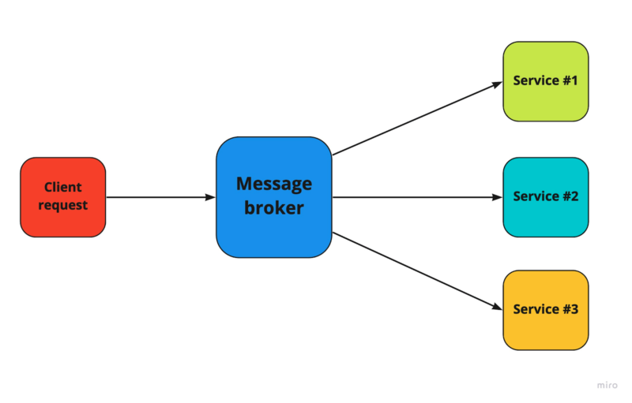
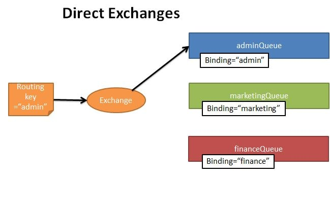
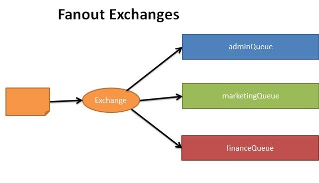
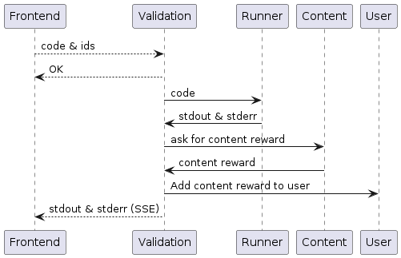
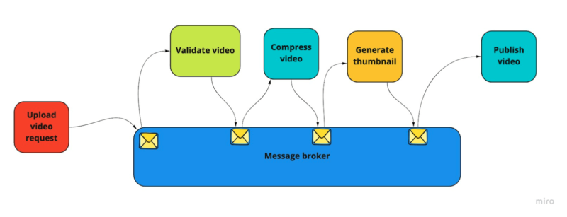
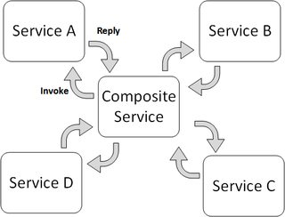

== Communication inter-microservices

=== Problèmatique

Dans un environnement de micro-services, chaque micro-service est indépendant et peut être déployé sur plusieurs instances. Cela permet de gérer la charge de manière dynamique, et d'ajuster le nombre d'instances en fonction de la charge.

Cependant, une architecture micro-service pose de nouveaux problèmes de communication. Dans un monolithe, il suffit simplement d'appeler une fonction pour communiquer avec un autre module. Dans une architecture micro-service, il faut mettre en place des mécanismes de communication entre les micro-services.

Voici les problèmes principaux que l'on rencontre dans une architecture micro-services:

1. Comment trouver l'adresse IP du service à joindre ? Ce point est abordé plus bas dans la section Découverte de services.
2. Comment empêcher un service injoignable de bloquer les autres services ? La section Circuit Breaker aborde ce point.
3. Quelles solutions mettre en place pour réduire l'attente liée aux communications intermicro-services ? Ce point est abordé plus bas dans la section Message Broker.
4. Comment conserver une cohérence des données malgré d'éventuelles erreurs de communication ? Ce point est abordé plus bas dans la section Saga Pattern.
5. Comment simplifier les API entre frontend et services backend ? Ce point est abordé plus bas dans la section API Gateway.

=== Découverte de services

=== Message Broker

==== Définition

Certes simples à mettre en place, les communications synchrones ont pour principal inconvénient de bloquer le client pendant l'exécution de la requête. Même dans le cas optimal où tous les micro-services fonctionnent normalement, bloquer plusieurs micro-services en attente d'une requête peut entraîner d'importants ralentissements parfois visibles par l'utilisateur.

Pour pallier à ce problème, il est de mise de mettre en place un système de communication asynchrone. Ce système permet de déléguer le traitement d'une requête à un autre micro-service, et de continuer le traitement de la requête sans attendre la réponse.

Le moyen le plus courant pour mettre en place une communication asynchrone est d'utiliser un Message Broker. Un Message Broker est un service qui permet de stocker des messages et de les distribuer aux clients. Les clients peuvent envoyer des messages au Message Broker, qui les stocke et les distribue aux clients qui les demandent. Les messages sont stockés dans une ou plusieurs files d'attente, et les clients peuvent choisir de recevoir les messages dans l'ordre ou non. Les messages peuvent être stockés dans le Message Broker pendant une durée limitée, ou jusqu'à ce qu'ils soient lus par un client. Les messages peuvent être envoyés à un seul client ou à plusieurs clients. Un tel service permet aux micro-services de lire les messages reçus par d'autres services dès qu'ils sont disponibles, même après un crash.

Les Message Brokers les plus connus sont:

* RabbitMQ
* Apache Kafka

.Message Broker
[align="center"]

==== Détails liés à RabbitMQ

RabbitMQ est un Message Broker open source implémentant le protocole AMQP (Advanced Message Queuing Protocol). Il est écrit en Erlang et est distribué sous licence Mozilla Public License. RabbitMQ définit et implémente les concepts suivants:

* Exchange: Un Exchange reçoit les messages des producteurs et les distribue aux queues. Dans le cas de RabbitMQ, il existe 3 types d'exchange, qui définissent la manière dont les messages sont distribués aux queues.
** Direct Exchange: Les messages sont distribués aux queues en fonction de la clé de routage. Si la clé de routage d'un message correspond à la clé de routage d'une queue, le message est envoyé à cette queue. Ce type d'Exchange est utilisé pour la communication point à point.
** Fanout Exchange: Les messages sont envoyés à toutes les queues liées à l'Exchange. Ce type d'Exchange est utilisé pour la communication de type publish/subscribe.
** Topic Exchange: Les messages sont envoyés aux queues dont la clé de routage correspond à la clé de routage du message. La clé de routage est une chaîne de caractères séparée par des points. Les caractères spéciaux "*" et "#" peuvent être utilisés pour définir des clés de routage génériques. Ce type d'Exchange est utilisé pour la communication de type publish/subscribe. un Topic Exchange permet de définir des règles de routage plus précises qu'avec un Fanout Exchange.
* Routing Key: La clé de routage est une chaîne de caractères utilisée par les Exchanges pour déterminer à quelles queues envoyer les messages. La clé de routage est définie par le producteur lors de l'envoi du message.
* Queue: Une queue est un espace de stockage des messages. Les messages sont stockés dans la queue jusqu'à ce qu'ils soient lus par un consommateur. Les queues sont liées à un Exchange, et reçoivent les messages envoyés à cet Exchange. Les messages sont envoyés aux queues en fonction de la clé de routage définie par le producteur.

[cols="3*" frame="none" align="center"]
|===
a|
.Direct Exchange
[align="center"]

a|
.Fanout Exchange
[align="center"]

a|
.Topic Exchange
[align="center"]
image::images/topic-exchange.jpeg[Topic Exchange]
|===

Dans le cas de PolyCode, une telle architecture devra certainement être mise en place pour gérer le processus d'execution du code. En effet, cela met en jeu le micro-service de gestion des contenu (Content service), de validation (Validation service), d'exécution (Runner service) et de gestion des utilisateurs (User service). Lors de la reception d'une requête cliente par le micro-service de validation, une réponse est rapidement renvoyé (OK si la requête est valide). Le retour d'execution du code de l'utilisateur est envoyé au client via du Server Side Event (SSE). Cela permet au service de validation de prévenir le client de la fin du processus d'execution du code, et de lui envoyer le résultat de l'execution, le tout, sans attendre de requête de sa part.

.Processus d'exécution du code
[align="center"]

=== Saga Pattern

==== Définition

Le Saga Pattern est un pattern de conception permettant de gérer les transactions dans un environnement distribué. Pour faire simple, Saga repose sur la décomposition d'une transaction en plusieurs actions plus simples à la charge de micro-services différents. L'objectif de Saga est de conserver la cohérence des données en cas d'échec d'une action, comme dans le cas d'une transaction ACID en base de donnée.

La mise en place du Saga Pattern va généralement de paire avec l'utilisation d'un Message Broker. En effet, le Message Broker permet de stocker les messages envoyés par les micro-services, et de les distribuer aux micro-services qui en ont besoin. Il permet également de gérer les échecs de communication entre les micro-services.

Par exemple, imaginons plusieurs micro-services travaillant de paire pour permettre à des utilisateurs de mettre en ligne une vidéo sur une plateforme dédiée. Dans notre exemple, le stockage, la validation, la compression, la génération de la miniature et la publication des vidéos sont des tâches effectuées par des micro-services différents. À l'aide de Saga Pattern et d'un Message Broker, on pourrait imaginer l'architecture suivante:

.Exemple de Saga Pattern
[align="center"]

Dans cette situation, si l'un des micro-service échoue avant la fin du processus, le Saga Pattern doit assurer que l'ensemble des opérations réussies seront annulées. Par exemple, si le micro-service de validation échoue, le micro-service de stockage doit supprimer la vidéo.

==== Types de Saga Pattern

On distingue deux types de Saga Pattern:

* Choreography-based Saga: Dans ce cas, chaque micro-service est responsable de la gestion de ses propres transactions. Chaque micro-service envoie un message au Message Broker lorsqu'une transaction est effectuée. Les autres micro-services écoutent les messages du Message Broker et effectuent les actions nécessaires. Ce type de Saga Pattern est plus simple à mettre en place, mais il est plus difficile de gérer les transactions complexes.
* Orchestration-based Saga: Dans ce cas, un micro-service est responsable de la gestion de l'ensemble des transactions. Ce micro-service est appelé Saga Orchestrator. Il envoie des messages au Message Broker pour indiquer aux autres micro-services les actions à effectuer. Ce type de Saga Pattern est plus complexe à mettre en place, mais il permet de gérer des transactions complexes.

[cols="2*" frame="none" align="center"]
|===
a|
.Choreography-based Saga
[align="center"]
image::images/choreography.jpeg[Choreography-based Saga]

a|
.Orchestration-based Saga
[align="center"]

|===

=== API Gateway

==== Définition

Une API Gateway est un point d'entrée unique pour les clients. Elle permet de simplifier l'accès aux micro-services en regroupant les appels à plusieurs micro-services en un seul appel. Elle permet également de cacher les détails d'implémentation des micro-services aux clients. Enfin, elle permet de mettre en place des politiques de sécurité et de contrôle d'accès.

En général, l'API Gateway est un service à part entière profitant lui aussi du Service Discovery pour relayer les requêtes vers les micro-services.

.API Gateway
[align="center"]
image::images/api-gateway.png[API Gateway]

Dans le cas de PolyCode, il pourrait être intéressant de mettre en place une API Gateway communiquant à l'aide du protocole gRPC avec les micro-services et HTTP avec les clients. Cela rendrait les API entre la Gateway et les micro-services plus robustes et plus performantes, et permettrait de mettre en place des politiques de sécurité et de contrôle d'accès plus facilement. De plus, cela permettrait de conserver une API pour les clients proche de celle actuellement utilisée (pas besoin d'effectuer de gros changements côté frontend).

=== Démonstration

Vous trouverez un exemple d'application suivant une architecture micro-services dans le repository suivant: https://github.com/RedbeanGit/polyshop

Cette application reprend les principes de base d'une marketplace en ligne. Elle est composée de 6 micro-services:

* **cart-service**: Service de gestion des paniers
* **catalog-service**: Service de gestion des produits
* **inventory-service**: Service de gestion des stocks
* **order-service**: Service de gestion des commandes
* **payment-service**: Service de gestion des paiements
* **shipping-service**: Service de gestion des livraisons

Ce repository contient également une **api-gateway**, un **discovery-service** et un **frontend**.

L'application est également déployée et accessible à l'adresse suivante: https://polyshop.redbean.fr
