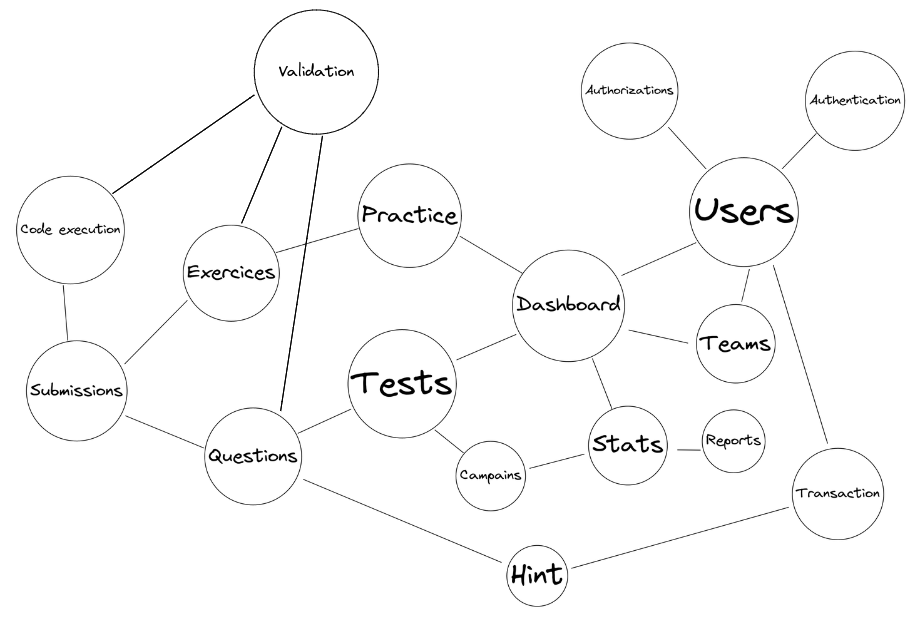
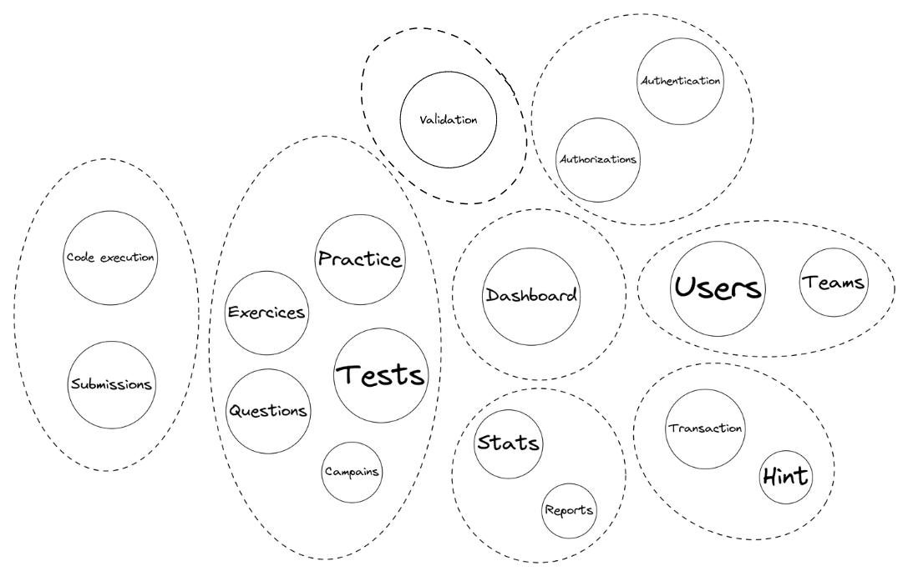
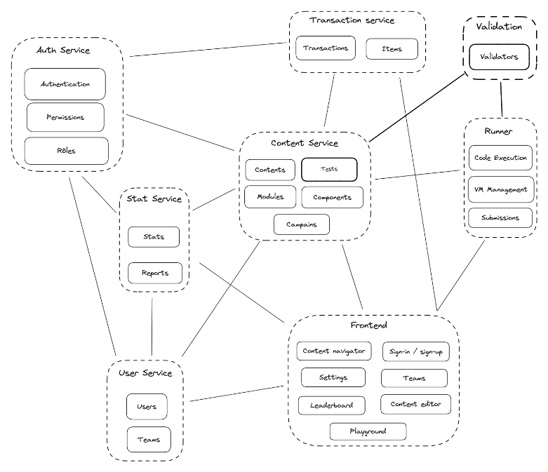

== Microservices

=== Objectifs

L'objectif de cette architecture est de permettre une évolution rapide et indépendante des fonctionnalités de l'application.

=== Découpage de PolyCode en quartiers fonctionnels

La première étape consiste à diviser le projet en quartiers fonctionnels en se basant sur les fonctionnalités souhaitées sur la plateforme. On obtient alors les quartiers suivants :

A partir du schéma précédant et en se basant sur les étapes du Domain Driven Design (DDD), on définit les contexts bornés (Bounded Context) du projet. On obtient alors les contexts suivants :

=== Définition des microservices

A partir des contexts bornés, on définit les microservices qui seront implémentés. On obtient alors les microservices suivants :

